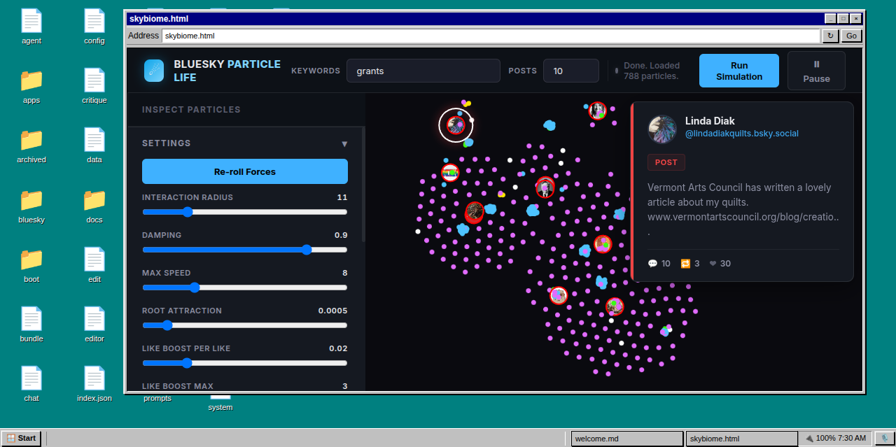
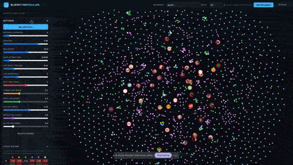

<div align=center>
  <div>
    
  </div>
  <h1>Operating System for influencing && making sense of collective experiences</h1>
  <p>Kernel 26.06.14</p>
  <div></div>
</div>

<br>

<table>
    <tbody>
        <tr>
            <td>
                <h4>Postscope</h4>
                <p></p>
                <p><a href="https://openresearchinstitute.org/sensemaker/#main?windows=skybiome.html{max}">Try it</a>
            </td>
        </tr>
    </tbody>
</table>

## What is it?
**The Sensemaker is a browser-based dashboard builder for social media.** You program the system by clicking and following hyperlinks that fetch, transform, and visualize data.

## Local Setup

### Requirements:
- git - https://git-scm.com/install/
- nodejs - https://nodejs.org/en/download

### Terminal Commands:
```bash
# clone the project and dependencies
git clone --recursive https://github.com/Open-Research-Institute/sensemaker

# install dependencies
npm run install

# start the server on http://localhost:8080
npm start
```

## Quickstart - First 5 minutes

coming soon

## How it works - the mental model

coming soon

## Cookbook - common tasks

coming soon

<br>
<hr>
<br>

# Going Deeper

The following documentation can be read by LLMs thru one of the following links:
- minimal version (good for agents): https://openresearchinstitute.org/sensemaker/llms.txt
- full version (good for offline or simple chatbots): https://openresearchinstitute.org/sensemaker/llms-full.txt

### Kernel

- [QRx Kernel](/): The live generative OS — a single HTML file that turns any browser into an offline-first REPL using URL hashes as a command tape and IndexedDB as a filesystem
- [Complete Source Corpus](/llms-full.txt): Every project file concatenated with <context> tags for deep LLM ingestion

### Core Source

- [README](/data/main/src/README.md): Project overview, kernel API reference, server setup, build pipeline, and developer notes
- [Kernel Source](/data/main/src/index.html): The bare kernel HTML — the entire OS in one file, minified to fit inside a QR code
- [Package Manifest](/data/main/src/package.json): Dependencies, npm scripts, and project metadata
- [Build Configuration](/data/main/src/vite.config.js): Vite build pipeline, QR code generation, bootloader injection, and PWA setup
- [Environment Template](/data/main/src/TEMPLATE.env): Configuration template for sync key, namespaces, and server port

### Server

- [Local Server](/data/main/src/servers/local.js): Express-based server with namespace routing, SSE streaming, auth, and IndexedDB sync
- [GitHub Pages Build](/data/main/src/servers/github.js): Pre-build step that mirrors server namespace logic for static hosting

### Guides

- [Hyperprompting Guide](/data/main/docs/hyperprompting-guide.md): Protocol specification, chain-authoring grammar, and debugging workflow for the QRx machine tape
- [LLM-Wrap Tutorial](/data/reddit/posts/hyperprompting/260621-how-to-llm-wrap-hyperlinks.md): How to create serverless Data URI hyperlinks and QR codes that generate ephemeral apps

### Theory

- [Welcome to Hyperprompting](/data/reddit/posts/hyperprompting/260620-welcome-to-hyperprompting.md): Introduction to the subreddit, the teleology of hypertext, and the project north star
- [What is a Dataverse](/data/reddit/posts/hyperprompting/260731-what-is-a-dataverse.md): Theory on digital universes, knowledge graphs, and the Ruliad as hypertext
- [Links That Click Themselves](/data/reddit/posts/hyperprompting/260810-links-that-click-themselves.md): On autopoietic hypertext, multiversal simulators, and links that navigate themselves
- [Generative Sneakernets](/data/reddit/posts/hyperprompting/260811-generative-sneakernets.md): Distributing code on paper via QR codes and regenerative zines
- [Hypercompression Theory](/data/reddit/posts/hyperprompting/260622-towards-hypercompression-of-autopoietic-hypertext.md): Semantic compression and the upper limits of QR-based hyperprompts
- [Autopoietic Hypertext](/data/reddit/posts/hyperprompting/260814-autopoeitic-hypertext.md): On hypertext that produces and maintains its own context
- [Welcome to Lab of Oz](/data/reddit/posts/labofoz/260811-welcome-to-labofoz.md): Towards a radio-based decentralized commune and radical gnosis

### Build

- [Social OS Devlog](/data/reddit/posts/hyperprompting/260624-towards-social-os.md): Building a social operating system with the Reddit port of the kernel
- [Minesweeper Demo](/data/reddit/posts/hyperprompting/260816-minesweeper.md): Interactive Minesweeper built with the Reddit port of the hyperprompting kernel

### Optional

- [Nonlinear Narratives](/data/reddit/posts/interactivefiction/260810-nonlinear-narratives.md): Technique for creating nonlinear narratives from swappable story segments
- [Cyborgmorphism](/data/reddit/posts/labofoz/260812-cyborgmorphism.md): On physically extended reality creatures and cyborgmorphism
- [Why I Turned Down OpenAI](/data/reddit/posts/labofoz/260818-why-i-turned-down-openai.md): Personal devlog on turning down OpenAI, Google, and Microsoft
- [Cybernetics Reading List](/data/reddit/posts/hyperprompting/260629-what-cybernetics-books-are-you-reading.md): Foundational cybernetics books and study approachper documentation - hosting and remixing your own simulators
